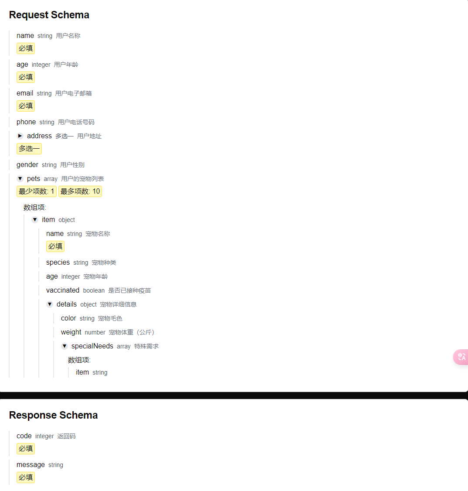
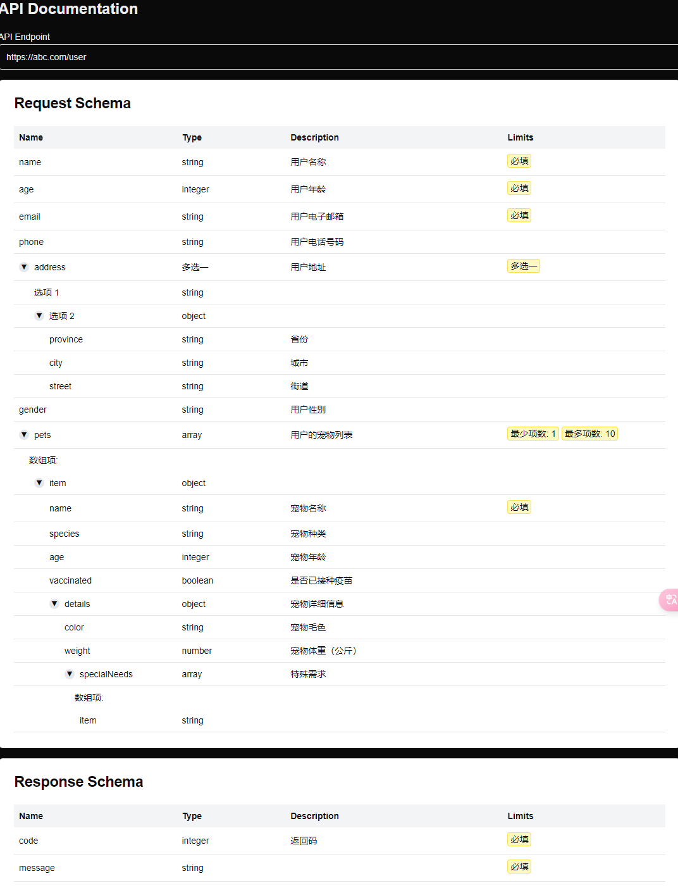

# 背景
1. 工程中有很多接口，直接使用 json schema 来定义，在文档工程中，需要表达这样的接口，因此需要一个 json schema viewer。

# 启动

要启动此项目，请按照以下步骤操作：

1. 确保您的系统已安装 Node.js 和 npm（或 yarn、pnpm、bun）。

2. 克隆项目仓库到本地：
   ```bash
   git clone [项目仓库URL]
   cd [项目目录名]
   ```

3. 安装项目依赖：
   ```bash
   npm install
   ```

4. 启动开发服务器：
   ```bash
   npm run dev
   ```

5. 打开浏览器，访问 [http://localhost:3000](http://localhost:3000) 查看项目运行结果。

现在，您可以开始编辑项目文件了。例如，修改 `app/page.tsx` 文件会自动更新页面内容。

如需了解更多关于 Next.js 的信息，请参考以下资源：
- [Next.js 文档](https://nextjs.org/docs)
- [Learn Next.js](https://nextjs.org/learn)


# 效果
## tree 型渲染 json schema 


## table 型渲染 json schema
